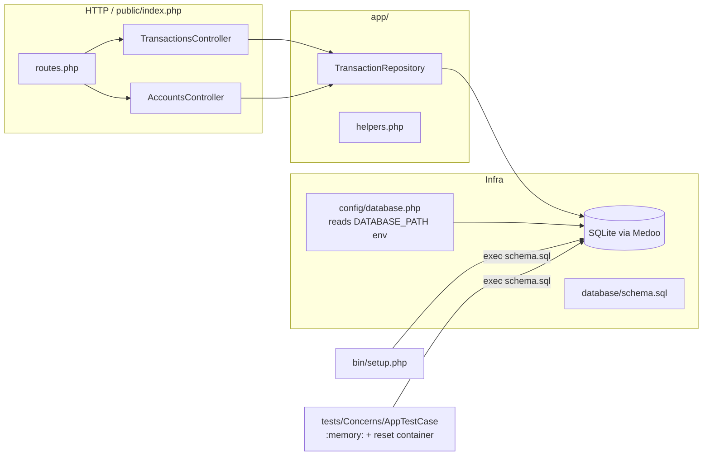

# Task 1 — Core Banking Transactions API

## Context

`homework-1/` is a starter scaffold (PHP 8.5 + Slim 4 + Medoo + SQLite + PHP-DI, dockerized on port 3000). Only a `GET /` hello-world route exists. Task 1 from `homework-1/TASKS.md` requires four real endpoints backed by storage:

| Method | Endpoint | Description |
|--------|----------|-------------|
| POST | `/transactions` | Create a new transaction |
| GET | `/transactions` | List all transactions |
| GET | `/transactions/:id` | Get a transaction by id |
| GET | `/accounts/:accountId/balance` | Get account balance |

Per the user's directives:
- **Reuse the prepared stack** (Slim/Medoo/SQLite/PHP-DI) — do not introduce new frameworks.
- **No in-memory storage in PHP** (each request is a fresh process) → persist in SQLite, run schema setup from `bin/setup.php`.
- **Tests**: one PHPUnit file per route, with individual methods per test case.

Filtering (Task 3), deeper validation (Task 2), and bonus features (Task 4) are out of scope here — only Task 1's "amount must be positive" + 200/201/400/404 are in scope.

## Architecture



## Key decisions (responding to feedback)

- **No `Migrations` service class.** Schema lives in plain SQL at `src/database/schema.sql`. Both `bin/setup.php` and `AppTestCase` read it with `file_get_contents()` and run it via `$db->pdo->exec(...)`. Single source of truth, no extra abstraction.
- **Smaller column types.** SQLite has type affinity (not enforced length, but used for portability/documentation). Schema uses sized types where it makes sense — see schema below.
- **UUIDs via `ramsey/uuid`.** Add `"ramsey/uuid": "^4.7"` to `src/composer.json` `require` block. Use `Ramsey\Uuid\Uuid::uuid4()->toString()` directly in the controller. No homegrown helper.
- **Seed via repository in tests** (confirmed).
- **`AppTestCase` carries shared helpers** so each test file stays small — see Test infrastructure below.

## Files to add / modify

### New

- `src/database/schema.sql`:
  ```sql
  CREATE TABLE IF NOT EXISTS transactions (
      id           VARCHAR(36) PRIMARY KEY,
      from_account VARCHAR(20),
      to_account   VARCHAR(20),
      amount       DECIMAL(15,2) NOT NULL,
      currency     CHAR(3)       NOT NULL,
      type         VARCHAR(20)   NOT NULL,
      timestamp    VARCHAR(30)   NOT NULL,
      status       VARCHAR(20)   NOT NULL
  );
  CREATE INDEX IF NOT EXISTS idx_transactions_from   ON transactions(from_account);
  CREATE INDEX IF NOT EXISTS idx_transactions_to     ON transactions(to_account);
  CREATE INDEX IF NOT EXISTS idx_transactions_type   ON transactions(type);
  CREATE INDEX IF NOT EXISTS idx_transactions_status ON transactions(status);
  ```
  (`from_account`/`to_account` nullable so deposits/withdrawals can leave one side empty.)
- `src/app/Repositories/TransactionRepository.php` — thin wrapper around `App\Services\Database`:
    - `create(array $data): array` — insert, return persisted record (snake↔camel mapping centralized here).
    - `all(): array` — `ORDER BY timestamp DESC`.
    - `find(string $id): ?array`.
    - `forAccount(string $accountId, string $status = 'completed'): array` — used by balance.
- `src/app/Controllers/TransactionsController.php`:
    - `create` — decode JSON; validate `amount > 0` and `type ∈ {deposit,withdrawal,transfer}`; `Uuid::uuid4()->toString()` for id; `gmdate('c')` for timestamp; default `status = 'completed'`. **201** on success, **400** with `{error:"Validation failed", details:[{field,message}]}` on invalid input (shape from `TASKS.md`).
    - `index` — list, **200**.
    - `show` — by id, **404** if missing.
- `src/app/Controllers/AccountsController.php`:
    - `balance` — sums per currency over `completed` rows: deposits credit `to_account`; withdrawals debit `from_account`; transfers debit `from_account` and credit `to_account`. Returns `{ "accountId": "...", "balances": [{ "currency": "USD", "amount": 50.0 }, ...] }`, **200** even with no activity.
- `src/tests/Transactions/CreateTransactionTest.php`
- `src/tests/Transactions/ListTransactionsTest.php`
- `src/tests/Transactions/ShowTransactionTest.php`
- `src/tests/Accounts/GetBalanceTest.php`

### Modify

- `src/composer.json` — add `"ramsey/uuid": "^4.7"` under `require`. Run `composer install` as part of `make setup`.
- `src/bin/setup.php` — replace the TODO with:
  ```php
  $db->pdo->exec(file_get_contents(__DIR__ . '/../database/schema.sql'));
  ```
- `src/config/database.php` — `'database' => getenv('DATABASE_PATH') ?: '/var/www/data/database.sqlite'`. Lets tests redirect to `:memory:`.
- `src/app/routes.php` — register the four new routes alongside the existing `GET /`.
- `src/app/Services/ContainerFactory.php` — add `public static function reset(): void { self::$container = null; }` so each test rebuilds the container against a fresh `:memory:` DB.
- `src/tests/Concerns/AppTestCase.php` — see Test infrastructure.

## Test infrastructure (`AppTestCase`)

Two changes here: a bug fix and shared helpers to keep individual test files lean.

**Bug fix:** the current `require __DIR__ . '/../bootstrap.php'` resolves to `tests/bootstrap.php` (autoload only — returns `1`, not the Slim app). Fix to `require __DIR__ . '/../../bootstrap.php'`. The existing `HomeTest` does not actually pass today.

**setUp lifecycle:**
1. `putenv('DATABASE_PATH=:memory:')` — points the next Medoo connection at an in-RAM SQLite DB.
2. `ContainerFactory::reset()` — drop the cached container so a new Medoo (and thus a new `:memory:` connection) is built.
3. `$this->app = require __DIR__ . '/../../bootstrap.php';`.
4. `$this->db = ContainerFactory::get()->get(Medoo::class);`.
5. `$this->db->pdo->exec(file_get_contents(__DIR__ . '/../../database/schema.sql'));` — apply schema to the fresh in-memory DB.
6. `$this->transactions = ContainerFactory::get()->get(TransactionRepository::class);`.

**Shared helpers (used by every test file):**
- `protected function get(string $uri): ResponseInterface`
- `protected function postJson(string $uri, array $body): ResponseInterface` — sets `Content-Type: application/json`, writes body.
- `protected function postRaw(string $uri, string $body): ResponseInterface` — for malformed-JSON case.
- `protected function decode(ResponseInterface $r): array` — `json_decode((string)$r->getBody(), true)`.
- `protected function assertStatus(int $expected, ResponseInterface $r): array` — asserts status, returns decoded body.
- `protected function seedTransaction(array $overrides = []): array` — calls `$this->transactions->create([...defaults, ...$overrides])` with sensible defaults (`type=transfer`, `currency=USD`, `status=completed`, fresh uuid + timestamp).
- `protected function assertValidationError(ResponseInterface $r, string $field): void` — asserts 400 + `error=Validation failed` + at least one `details` entry for `$field`.

These helpers turn each test method into 3–6 lines.

## Test plan (one file per route, methods per case)

`CreateTransactionTest.php`:
- `testCreatesTransactionAndReturns201`
- `testGeneratesIdAndTimestampWhenMissing`
- `testRejectsNegativeAmount` (uses `assertValidationError`)
- `testRejectsZeroAmount`
- `testRejectsInvalidJson`
- `testRejectsUnknownType`

`ListTransactionsTest.php`:
- `testReturnsEmptyArrayWhenNoTransactions`
- `testReturnsAllTransactions`
- `testOrdersByTimestampDescending`

`ShowTransactionTest.php`:
- `testReturnsTransactionById`
- `testReturns404WhenMissing`

`GetBalanceTest.php`:
- `testReturnsZeroBalancesForUnknownAccount`
- `testSumsDepositsAndWithdrawals`
- `testHandlesTransfersBothDirections`
- `testGroupsByCurrency`
- `testIgnoresNonCompletedTransactions`

Each test arranges via `seedTransaction(...)`, acts via `get(...)`/`postJson(...)`, asserts via `assertStatus(...)` / `assertValidationError(...)`.

## Verification

1. `cd homework-1 && make up`.
2. `make setup` — runs `composer install` (pulls `ramsey/uuid`) and `bin/setup.php`; should print `Setup complete.` and create `data/database.sqlite` with the `transactions` table.
3. `make phpunit` — `HomeTest` + 4 new files all pass against `:memory:` SQLite.
4. Manual smoke (curl examples from `TASKS.md` lines 158–178):
    - `POST /transactions` valid body → **201** with generated `id`/`timestamp`.
    - `POST /transactions` `amount: -1` → **400** `{error:"Validation failed", details:[{field:"amount", ...}]}`.
    - `GET /transactions` → array including the created record.
    - `GET /transactions/<id>` → record; `GET /transactions/missing` → **404**.
    - After seeding deposits/withdrawals/transfers, `GET /accounts/ACC-12345/balance` returns correct per-currency totals.