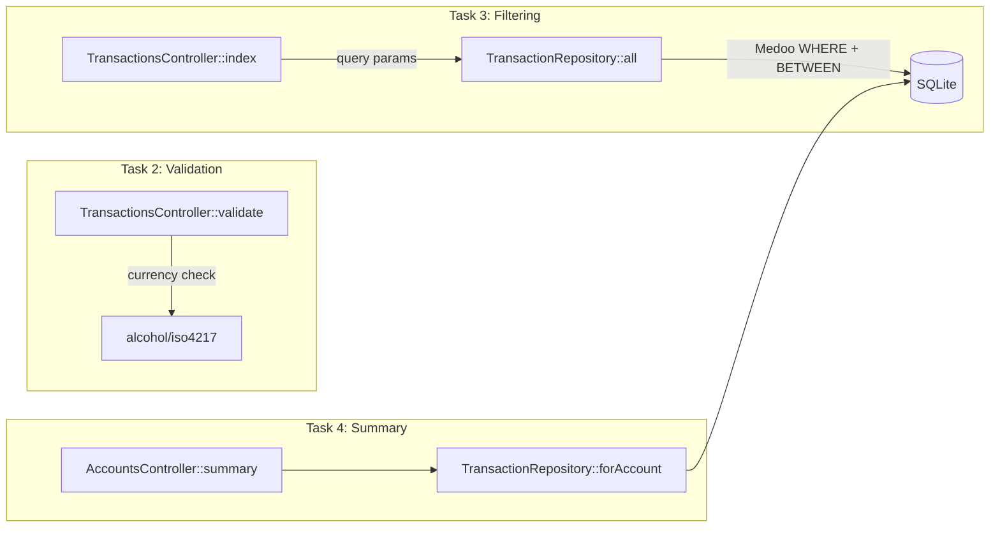

# Implementation Plan — Tasks 2, 3 & 4: Validation, Filtering & Summary

## Problem Statement

Extend the existing banking API (Task 1 complete) with transaction validation (Task 2), transaction history filtering (Task 3), and an account summary endpoint (Task 4a).

## Requirements

- **Task 2 — Transaction Validation:**
  - Amount: positive, max 2 decimal places
  - Account format: strict `ACC-XXXXX` (exactly 5 alphanumeric chars)
  - Currency: validated against ISO 4217 via `alcohol/iso4217` package
  - Return structured error response `{error, details[{field, message}]}`
  - Update all existing test seeds to use `ACC-XXXXX` format

- **Task 3 — Transaction History Filtering:**
  - `GET /transactions?accountId=ACC-12345` — filter by account (from or to)
  - `GET /transactions?type=transfer` — filter by type
  - `GET /transactions?from=2024-01-01&to=2024-01-31` — filter by date range
  - Combine multiple filters

- **Task 4a — Transaction Summary:**
  - `GET /accounts/:accountId/summary`
  - Returns: total deposits, total withdrawals, number of transactions, most recent transaction date

## Background

- Stack: PHP 8.5, Slim 4, Medoo (SQLite), PHP-DI, PHPUnit 11
- Existing architecture: `AbstractController` → `TransactionsController` / `AccountsController` → `TransactionRepository` → `Database` (Medoo wrapper)
- Medoo supports `[<>]` for BETWEEN (date range), `OR` for multi-column matching, standard equality for type filtering
- `alcohol/iso4217` provides `getByAlpha3($code)` — throws `OutOfBoundsException` for invalid codes
- Current validation in `TransactionsController::validate()` checks amount > 0, type ∈ {deposit, withdrawal, transfer}, currency non-empty
- All test seeds currently use `ACC-001`, `ACC-002`, etc. — must be updated to `ACC-XXXXX` format (e.g., `ACC-00001`, `ACC-00002`)

## Proposed Solution

## Task Breakdown

### Task 1: Add `alcohol/iso4217` dependency and extract a Validator service

- **Objective:** Install the ISO 4217 package and extract validation logic from the controller into a dedicated `App\Services\TransactionValidator` class, preparing for Task 2's expanded rules.
- **Implementation guidance:**
  - Add `"alcohol/iso4217": "^4.0"` to `composer.json` `require` block, run `composer install` inside the docker container: `docker compose exec php composer install`
  - Create `src/app/Services/TransactionValidator.php` with a `validate(array $data): array` method
  - Move the existing validation logic from `TransactionsController::validate()` into this new class
  - Inject `TransactionValidator` into `TransactionsController` via constructor; replace the private `validate()` call
  - No new validation rules yet — just the extraction
- **Test requirements:** Run existing tests — all 17 must still pass (no behavior change). Run tests via: `docker compose exec php ./vendor/bin/phpunit`
- **Demo:** Existing validation still works identically; `TransactionValidator` is a standalone, injectable service

### Task 2: Implement strict validation rules (amount, account, currency)

- **Objective:** Add the three new validation rules: max 2 decimal places for amount, `ACC-XXXXX` format for accounts, ISO 4217 currency validation.
- **Implementation guidance:**
  - In `TransactionValidator`:
    - Amount decimal check: use regex or multiply-by-100 approach to verify ≤ 2 decimal places
    - Account validation: regex `/^ACC-[A-Za-z0-9]{5}$/` applied to `fromAccount` and `toAccount` (when present — deposits have no `fromAccount`, withdrawals have no `toAccount`)
    - Currency: instantiate `Alcohol\ISO4217\ISO4217`, call `getByAlpha3(strtoupper($currency))`, catch `OutOfBoundsException` → validation error
  - Update all test seeds in `AppTestCase::seedTransaction()` defaults and all test files: `ACC-001` → `ACC-00001`, `ACC-002` → `ACC-00002`, `ACC-999` → `ACC-99999`, etc.
- **Test requirements:**
  - New test file `src/tests/Transactions/ValidationTest.php`:
    - `testRejectsAmountWithMoreThanTwoDecimals` (e.g., `100.123`)
    - `testAcceptsTwoDecimalAmount` (e.g., `100.12`)
    - `testAcceptsWholeNumberAmount`
    - `testRejectsInvalidAccountFormat` (e.g., `12345`, `ACC-1`, `ACC-TOOLONG`)
    - `testAcceptsValidAccountFormat` (e.g., `ACC-AB123`)
    - `testRejectsInvalidCurrencyCode` (e.g., `XXX`, `FAKE`)
    - `testAcceptsValidCurrencyCode` (e.g., `USD`, `EUR`, `JPY`)
    - `testReturnsMultipleErrorsAtOnce` — send amount=-1, currency=FAKE, fromAccount=bad → 3 errors
    - `testDepositDoesNotRequireFromAccount`
    - `testWithdrawalDoesNotRequireToAccount`
    - `testTransferRequiresBothAccounts`
  - All existing 17 tests updated with valid `ACC-XXXXX` format and still passing
- **Demo:** `POST /transactions` with `currency: "FAKE"` → 400 with `{field: "currency", message: "Invalid currency code"}`; with `fromAccount: "123"` → 400 with account format error; with `amount: 100.123` → 400 with decimal places error

### Task 3: Implement transaction filtering on GET /transactions

- **Objective:** Add query parameter filtering to the list endpoint: `accountId`, `type`, `from`/`to` date range, and combinations.
- **Implementation guidance:**
  - In `TransactionsController::index()`: extract query params from `$request->getQueryParams()`
  - Pass filter params to a new `TransactionRepository::filter(array $filters): array` method (or extend `all()` to accept optional filters)
  - Build Medoo WHERE clause dynamically:
    - `accountId` → `OR` condition on `from_account` and `to_account`
    - `type` → equality on `type` column
    - `from`/`to` → `timestamp[<>]` BETWEEN using Medoo's range syntax. If only `from`, use `timestamp[>=]`; if only `to`, use `timestamp[<=]`
  - Keep `ORDER BY timestamp DESC`
  - If no filters provided, behave identically to current `all()`
- **Test requirements:**
  - New test file `src/tests/Transactions/FilterTransactionsTest.php`:
    - `testFiltersByAccountId` — seed transactions for multiple accounts, filter by one
    - `testFiltersByType` — seed deposit + transfer, filter `?type=deposit`
    - `testFiltersByDateRange` — seed transactions across dates, filter with `from` and `to`
    - `testFiltersByFromDateOnly` — only `?from=` param
    - `testFiltersByToDateOnly` — only `?to=` param
    - `testCombinesMultipleFilters` — `?accountId=ACC-00001&type=transfer`
    - `testReturnsEmptyArrayWhenNoMatch`
    - `testReturnsAllWhenNoFilters` — existing behavior preserved
  - Existing `ListTransactionsTest` still passes unchanged
- **Demo:** `GET /transactions?accountId=ACC-00001&type=transfer` returns only transfers involving that account; `GET /transactions?from=2024-01-01&to=2024-06-30` returns only transactions in that date range

### Task 4: Implement account summary endpoint

- **Objective:** Add `GET /accounts/:accountId/summary` returning aggregated transaction stats.
- **Implementation guidance:**
  - Add route in `routes.php`: `$app->get('/accounts/{accountId}/summary', [AccountsController::class, 'summary'])`
  - In `AccountsController::summary()`: reuse `$this->repository->forAccount($accountId, 'completed')` to get all completed transactions for the account
  - Compute in PHP (same pattern as `balance()`):
    - `totalDeposits`: sum of amounts where type=deposit and to_account=accountId
    - `totalWithdrawals`: sum of amounts where type=withdrawal and from_account=accountId
    - `transactionCount`: total number of completed transactions involving the account
    - `mostRecentTransaction`: max timestamp, or `null` if no transactions
  - Response shape: `{"accountId": "ACC-00001", "totalDeposits": 1000.0, "totalWithdrawals": 150.0, "transactionCount": 5, "mostRecentTransaction": "2024-06-01T..."}`
  - Return 200 even for unknown accounts (zeros + null)
- **Test requirements:**
  - New test file `src/tests/Accounts/GetSummaryTest.php`:
    - `testReturnsZerosForUnknownAccount`
    - `testSumsDepositsCorrectly`
    - `testSumsWithdrawalsCorrectly`
    - `testCountsAllTransactionTypes`
    - `testReturnsMostRecentTransactionDate`
    - `testIgnoresNonCompletedTransactions`
    - `testIncludesTransfersInCount`
  - All existing tests still pass
- **Demo:** After seeding several transactions, `GET /accounts/ACC-00001/summary` returns correct totals, count, and most recent date

### Task 5: Update HTTP client file and run full verification

- **Objective:** Add new test requests to `http-client/api.http` for all new functionality and verify everything works end-to-end.
- **Implementation guidance:**
  - Add validation error test cases (bad currency, bad account format, too many decimals)
  - Add filter examples (`?accountId=`, `?type=`, `?from=&to=`, combined)
  - Add summary endpoint request
  - Update existing requests to use `ACC-XXXXX` format account IDs
  - Run `make phpunit` — all tests pass
  - Run manual smoke tests via HTTP client
- **Test requirements:** Full PHPUnit suite green (all existing + all new tests)
- **Demo:** Complete HTTP client file covers all endpoints and edge cases; full test suite passes; manual requests demonstrate validation errors, filtered results, and summary data

## Key technical notes

- Run composer commands inside docker: `docker compose exec php composer install`
- Run tests inside docker: `docker compose exec php ./vendor/bin/phpunit`
- The `AppTestCase` uses `:memory:` SQLite with `ContainerFactory::reset()` per test
- Follow existing code style: strict types, PSR-4 autoloading, inject via constructor, use `AbstractController::json()` for responses
- Keep code minimal — no extra abstractions beyond what's needed
