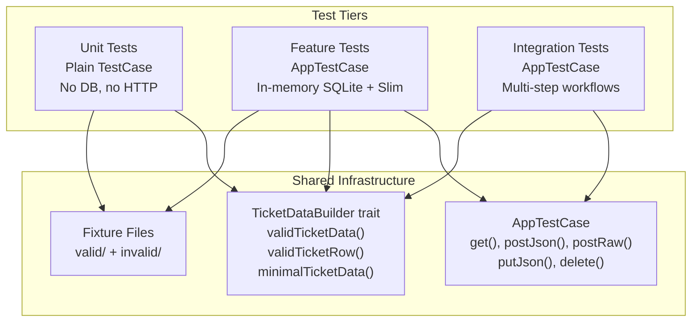

# Design Document: Test Suite Generation

## Overview

This design specifies the comprehensive PHPUnit 11 test suite for the Intelligent Customer Support System. The suite covers 16 requirement areas across unit tests, feature (HTTP) tests, and integration workflow tests, targeting >85% code coverage.

The test suite is organized into three tiers:

1. **Unit tests** (`tests/Unit/`) — test individual classes in isolation with no database or HTTP stack. Collaborators are stubbed or mocked.
2. **Feature tests** (`tests/Feature/`) — test full HTTP request→response cycles through the Slim app with an in-memory SQLite database, using `AppTestCase`.
3. **Integration tests** (`tests/Integration/`) — test multi-step workflows that compose several API calls to verify end-to-end behavior.

All tests run via `make phpunit` inside Docker. No host-side PHP execution is required.

### Design Decisions

- **AppTestCase enhancement**: The existing `AppTestCase` base class provides `get()`, `postJson()`, and `postRaw()` helpers. We add `putJson()` and `delete()` to support PUT and DELETE endpoint testing without duplicating request-building logic in every test.
- **TicketDataBuilder trait**: A shared `TicketDataBuilder` trait provides factory methods for generating valid ticket payloads and database rows. This avoids duplicating fixture data across 10+ test classes and keeps test data consistent with the validation rules.
- **Classification tests resolve through DI**: Classification tests use `$this->app->getContainer()->get(ClassifierInterface::class)` to resolve the classifier, verifying the DI wiring rather than testing `NullClassifier` directly.
- **Auto-classify endpoint assumed**: The `POST /tickets/{id}/auto-classify` route is assumed to exist (per Task 2 in TASKS.md). Feature tests for this endpoint validate the route, controller action, and classification integration.
- **Fixture files for import tests**: Existing fixture files in `tests/fixtures/valid/` and `tests/fixtures/invalid/` are used for import feature tests and parser unit tests. No new fixture files are needed — the existing set covers CSV, JSON, XML in both valid and malformed variants, plus XXE and CSV injection attack vectors.

## Architecture

The test suite mirrors the production source tree structure:

```
src/tests/
├── Concerns/
│   └── AppTestCase.php              # Enhanced with putJson(), delete()
├── Traits/
│   └── TicketDataBuilder.php        # Shared valid-data factory methods
├── Unit/
│   ├── Entities/
│   │   ├── TicketTest.php           # Req 2 (existing, extended)
│   │   └── TicketMetadataTest.php   # Req 15
│   ├── Enums/
│   │   └── TicketEnumsTest.php      # Req 16
│   ├── Filters/
│   │   └── TicketFilterTest.php     # Req 11
│   ├── Http/
│   │   └── ErrorRendererTest.php    # Req 13
│   ├── Parsers/
│   │   ├── CsvTicketParserTest.php  # Req 4
│   │   ├── JsonTicketParserTest.php # Req 5
│   │   ├── XmlTicketParserTest.php  # Req 7
│   │   └── ParserRegistryTest.php   # Req 8
│   ├── Services/
│   │   ├── ImportServiceTest.php    # Req 9
│   │   └── ClassificationTest.php   # Req 6
│   └── Validation/
│       └── TicketValidatorTest.php  # Req 3
├── Feature/
│   ├── Health/
│   │   └── HandshakeTest.php        # Existing
│   └── Tickets/
│       ├── CreateTicketTest.php     # Req 1 (create subset)
│       ├── ReadTicketTest.php       # Req 1 (show/list subset)
│       ├── UpdateTicketTest.php     # Req 1 (update subset)
│       ├── DeleteTicketTest.php     # Req 1 (delete subset)
│       ├── AutoClassifyTest.php     # Req 1 (classify subset)
│       ├── ListFilterTest.php       # Req 12
│       └── ImportTicketTest.php     # Req 10
├── Integration/
│   └── TicketLifecycleTest.php      # Req 14
├── fixtures/
│   ├── valid/                       # Existing CSV, JSON, XML samples
│   └── invalid/                     # Existing malformed + attack vectors
└── bootstrap.php                    # Existing
```



## Components and Interfaces

### 1. AppTestCase (Enhanced)

**File:** `src/tests/Concerns/AppTestCase.php`

The existing abstract base class is extended with two new HTTP helper methods:

```php
abstract class AppTestCase extends TestCase
{
    // Existing: setUp(), get(), postJson(), postRaw(), createRequest()

    /** Send a PUT request with a JSON body. */
    protected function putJson(string $path, array $data): ResponseInterface;

    /** Send a DELETE request. */
    protected function delete(string $path): ResponseInterface;
}
```

**Design rationale:** These follow the same pattern as the existing `postJson()` — they build a PSR-7 request, set the appropriate Content-Type header, and pass it through `$this->app->handle()`. Keeping them in the base class avoids duplicating request construction in every feature test.

### 2. TicketDataBuilder Trait

**File:** `src/tests/Traits/TicketDataBuilder.php`

A trait providing factory methods for test data. Used by both unit and feature tests.

```php
trait TicketDataBuilder
{
    /** Returns a complete valid ticket payload suitable for POST /tickets. */
    protected function validTicketData(array $overrides = []): array;

    /** Returns a valid database row array suitable for Ticket::fromRow(). */
    protected function validTicketRow(array $overrides = []): array;

    /** Returns the minimal required fields for ticket creation. */
    protected function minimalTicketData(array $overrides = []): array;
}
```

**Design rationale:** A trait (not a base class) because it needs to be mixed into both `TestCase` subclasses (unit) and `AppTestCase` subclasses (feature/integration). The `$overrides` parameter lets each test customize only the fields it cares about while inheriting sensible defaults.

### 3. Unit Test Classes

Each unit test class extends `PHPUnit\Framework\TestCase` directly (no app bootstrap, no database).

| Class | Tests | Key Approach |
|---|---|---|
| `TicketTest` | Req 2 — entity hydration, serialization, round-trip | Extend existing 4 tests with round-trip coverage |
| `TicketMetadataTest` | Req 15 — metadata construction, fromRow, toRow, round-trip | Direct instantiation with enum values |
| `TicketEnumsTest` | Req 16 — all 5 enums: case count, backing values, from/tryFrom | Parameterized data providers per enum |
| `TicketFilterTest` | Req 11 — fromParams defaults, mapping, clamping | Direct construction, no mocks needed |
| `ErrorRendererTest` | Req 13 — ValidationException, HttpNotFoundException, generic | Instantiate renderer, pass exception stubs |
| `CsvTicketParserTest` | Req 4 — valid parse, tags normalization, metadata flattening, empty, malformed, injection | Uses fixture files from `tests/fixtures/` |
| `JsonTicketParserTest` | Req 5 — array parse, nested tickets key, empty, malformed, non-array | Inline JSON strings + fixture files |
| `XmlTicketParserTest` | Req 7 — valid parse, nested metadata, tags, empty, malformed, XXE/DTD | Uses fixture files including `xxe.xml` |
| `ParserRegistryTest` | Req 8 — resolve by MIME, charset stripping, unsupported, format fallback | Construct registry with mock parsers |
| `ImportServiceTest` | Req 9 — orchestration, per-row errors, parse failure, unsupported type | Mock ParserRegistry + TicketService |
| `ClassificationTest` | Req 6 — DI resolution, ClassificationResult shape, TicketService integration | Resolve from container; mock classifier for TicketService test |

### 4. Feature Test Classes

Each feature test class extends `AppTestCase` and uses `TicketDataBuilder`.

| Class | Tests | Key Approach |
|---|---|---|
| `CreateTicketTest` | Req 1.1, 1.2, 1.11 | POST /tickets with valid/invalid data, auto_classify flag |
| `ReadTicketTest` | Req 1.3, 1.4, 1.5, 1.6 | GET /tickets and GET /tickets/{id} |
| `UpdateTicketTest` | Req 1.7, 1.8 | PUT /tickets/{id} with valid/invalid data |
| `DeleteTicketTest` | Req 1.9, 1.10 | DELETE /tickets/{id} existing and non-existent |
| `AutoClassifyTest` | Req 1.12, 1.13 | POST /tickets/{id}/auto-classify |
| `ListFilterTest` | Req 12.1–12.6 | GET /tickets with category, priority, status, q, limit, offset, sort |
| `ImportTicketTest` | Req 10.1–10.5 | POST /tickets/import with CSV, JSON, XML, invalid rows, unsupported type |

### 5. Integration Test Class

| Class | Tests | Key Approach |
|---|---|---|
| `TicketLifecycleTest` | Req 14.1–14.4 | Multi-step workflows: full CRUD lifecycle, import-then-list, combined filters, classify-then-read |

### 6. Classification Test Design

Classification tests verify the DI wiring and interface contract rather than testing `NullClassifier` in isolation:

```php
// Resolve from container — tests DI binding
$classifier = $this->app->getContainer()->get(ClassifierInterface::class);
$this->assertInstanceOf(ClassifierInterface::class, $classifier);

// Call classify — tests interface contract
$result = $classifier->classify($ticket);
$this->assertInstanceOf(ClassificationResult::class, $result);
$this->assertGreaterThanOrEqual(0.0, $result->confidence);
$this->assertLessThanOrEqual(1.0, $result->confidence);
```

For the `TicketService::create()` auto-classify integration (Req 6.7), the test replaces the container binding with a mock classifier that returns known values, then verifies those values are persisted on the ticket.

## Data Models

### Test Data Shapes

**Valid ticket payload** (for POST /tickets):
```php
[
    'customer_id'    => 'cust-test-001',
    'customer_email' => 'test@example.com',
    'customer_name'  => 'Test User',
    'subject'        => 'Test ticket subject',
    'description'    => 'A sufficiently long description for validation (min 10 chars).',
    'category'       => 'technical_issue',
    'priority'       => 'medium',
    'status'         => 'new',
    'tags'           => ['test', 'unit'],
    'metadata'       => [
        'source'      => 'web_form',
        'browser'     => 'PHPUnit',
        'device_type' => 'desktop',
    ],
]
```

**Valid database row** (for Ticket::fromRow()):
```php
[
    'id'                        => 'test-uuid-001',
    'customer_id'               => 'cust-test-001',
    'customer_email'            => 'test@example.com',
    'customer_name'             => 'Test User',
    'subject'                   => 'Test ticket subject',
    'description'               => 'A sufficiently long description for validation.',
    'category'                  => 'technical_issue',
    'priority'                  => 'medium',
    'status'                    => 'new',
    'assigned_to'               => null,
    'tags'                      => '["test","unit"]',
    'metadata_source'           => 'web_form',
    'metadata_browser'          => 'PHPUnit',
    'metadata_device_type'      => 'desktop',
    'classification_confidence' => null,
    'classification_reasoning'  => null,
    'classification_keywords'   => null,
    'created_at'                => '2024-01-15T10:00:00+00:00',
    'updated_at'                => '2024-01-15T10:00:00+00:00',
    'resolved_at'               => null,
]
```

**ImportSummary shape** (returned from POST /tickets/import):
```php
[
    'total'      => 5,
    'successful' => 4,
    'failed'     => 1,
    'errors'     => [
        ['row' => 3, 'field' => 'customer_email', 'message' => '...', 'raw' => [...]],
    ],
]
```

**Validation error shape** (returned from 400 responses):
```php
[
    'error'   => 'Validation failed',
    'details' => [
        'customer_email' => 'The Customer Email is not valid email',
        'subject'        => 'The Subject must be between 1 and 200',
    ],
]
```

### Fixture Files (Existing)

| File | Purpose | Used By |
|---|---|---|
| `fixtures/valid/sample_tickets.csv` | 5 valid CSV rows with headers | CsvTicketParserTest, ImportTicketTest |
| `fixtures/valid/sample_tickets.json` | 3 valid JSON ticket objects | JsonTicketParserTest, ImportTicketTest |
| `fixtures/valid/sample_tickets.xml` | 3 valid XML tickets with nested metadata/tags | XmlTicketParserTest, ImportTicketTest |
| `fixtures/invalid/malformed.csv` | CSV with missing/invalid field values | CsvTicketParserTest |
| `fixtures/invalid/malformed.json` | Truncated JSON (parse error) | JsonTicketParserTest |
| `fixtures/invalid/malformed.xml` | XML with unclosed tag | XmlTicketParserTest |
| `fixtures/invalid/csv_injection.csv` | CSV with formula injection patterns | CsvTicketParserTest |
| `fixtures/invalid/xxe.xml` | XML with DOCTYPE/ENTITY declarations | XmlTicketParserTest |

