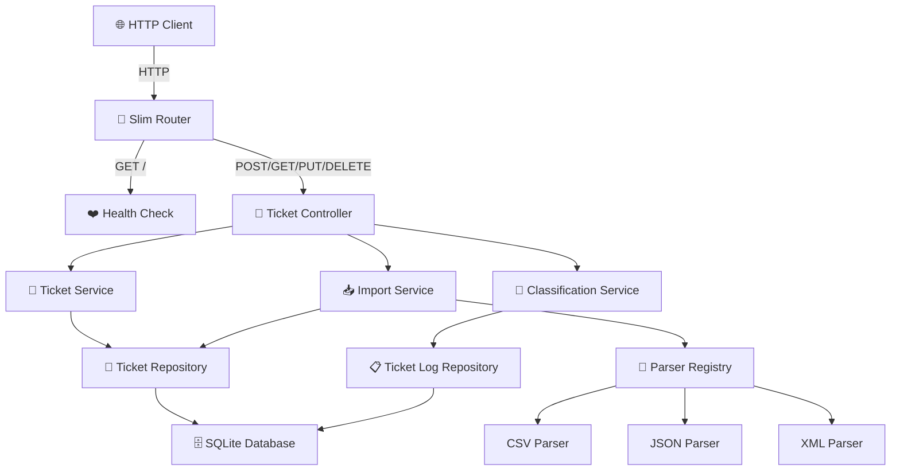

# 🎧 Homework 2: Intelligent Customer Support System

> **Student Name**: Oleksandr Prokopenko  
> **Date Submitted**: 28.04.2026  
> **AI Tools Used**: Kiro CLI, Kiro CLI (JetBrains plugin), Claude Code CLI, Claude Code (VS Code plugin)

---

A modern PHP REST API for managing support tickets with multi-format import capabilities, automatic classification, and comprehensive testing. Built with Slim 4, SQLite, and PHP-DI.

**Status**: ✅ Production Ready | **Coverage**: >85% | **PHP**: 8.5+

---

## 🎯 Features

- **Multi-Format Import** — Parse CSV, JSON, and XML ticket data with validation
- **Smart Auto-Classification** — Automatically categorize tickets and assign priorities based on content analysis
- **RESTful API** — Full CRUD operations with filtering and search capabilities
- **Comprehensive Testing** — >85% code coverage with unit and feature tests
- **Docker-Ready** — Containerized PHP environment with automatic setup
- **SQLite Database** — Zero-configuration relational storage
- **Error Handling** — Detailed validation errors and meaningful HTTP status codes

---

## 🏗️ Architecture



---

## 📦 Project Structure

```
.
├── src/
│   ├── app/
│   │   ├── Controllers/          # HTTP request handlers
│   │   │   ├── HealthController.php
│   │   │   ├── TicketsController.php
│   │   │   └── AbstractController.php
│   │   ├── Services/             # Business logic layer
│   │   │   ├── TicketService.php
│   │   │   ├── ImportService.php
│   │   │   ├── Database.php
│   │   │   └── ContainerFactory.php
│   │   ├── Repositories/         # Data access layer
│   │   │   ├── TicketRepository.php
│   │   │   └── TicketLogRepository.php
│   │   ├── Parsers/              # Multi-format file parsers
│   │   │   ├── CsvTicketParser.php
│   │   │   ├── JsonTicketParser.php
│   │   │   ├── XmlTicketParser.php
│   │   │   ├── ParserRegistry.php
│   │   │   └── TicketImportParserInterface.php
│   │   ├── Entities/             # Data models
│   │   ├── Enums/                # PHP Enums for categories and statuses
│   │   ├── Validation/           # Request validation rules
│   │   ├── Filters/              # Query filters
│   │   ├── Http/                 # HTTP middleware and error handling
│   │   ├── routes.php            # Route definitions
│   │   └── helpers.php           # Utility functions
│   ├── config/
│   │   ├── database.php          # Database configuration
│   │   ├── container.php         # Dependency injection setup
│   │   └── classification.php    # Classification rules
│   ├── database/
│   │   └── schema.sql            # SQLite schema
│   ├── public/
│   │   └── index.php             # Application entry point
│   ├── tests/
│   │   ├── Unit/                 # Unit tests (classes in isolation)
│   │   ├── Feature/              # Feature tests (HTTP endpoints)
│   │   ├── Integration/          # Integration tests
│   │   ├── Performance/          # Performance benchmarks
│   │   ├── fixtures/             # Sample data for tests
│   │   └── Traits/               # Test utilities and helpers
│   ├── bin/
│   │   └── setup.php             # Database setup script
│   ├── vendor/                   # Composer dependencies
│   └── composer.json
├── docker/                       # Docker configuration
├── docker-compose.yml
├── Makefile                      # Development commands
└── docs/                         # Additional documentation
```

---

## 🚀 Quick Start

### Prerequisites

- Docker and Docker Compose
- Make (optional, but recommended)

### Installation

```bash
# Clone the repository (if applicable)
cd homework-2

# Build Docker image, start services, install dependencies, and migrate database
make setup

# Verify the API is running
make test
```

The API will be available at `http://localhost:3000`

### Docker Troubleshooting

If you encounter permission issues with the SQLite database:

```bash
# Fix ownership on the host side
make chown
```

---

## 📡 API Usage

For comprehensive API documentation including all endpoints, request/response examples, and curl commands, see **[API_REFERENCE.md](docs/API_REFERENCE.md)**.

**Quick Start:**

```bash
# Health check
curl http://localhost:3000/

# Create a ticket
curl -X POST http://localhost:3000/tickets -H "Content-Type: application/json" -d '{...}'

# List all tickets
curl http://localhost:3000/tickets

# Import tickets from CSV
curl -X POST http://localhost:3000/tickets/import -H "Content-Type: text/csv" --data-binary @demo/sample_tickets.csv

# Auto-classify a ticket
curl -X POST http://localhost:3000/tickets/{id}/auto-classify
```

> See **[API_REFERENCE.md](docs/API_REFERENCE.md)** for complete API documentation with detailed examples.

---

## 🧪 Testing

### Run All Tests

```bash
make phpunit
```

### Run Specific Test Suite

```bash
# Unit tests only
make shell
./vendor/bin/phpunit tests/Unit/

# Feature tests only
./vendor/bin/phpunit tests/Feature/

# Integration tests
./vendor/bin/phpunit tests/Integration/
```

### Test Coverage Report

```bash
make shell
./vendor/bin/phpunit --coverage-html coverage/
```

Open `coverage/index.html` to view the HTML coverage report.

### Test Structure

- **Unit Tests** (`tests/Unit/`) — Test individual classes in isolation
- **Feature Tests** (`tests/Feature/`) — Test HTTP endpoints and full request/response cycles
- **Integration Tests** (`tests/Integration/`) — Test multi-component workflows
- **Performance Tests** (`tests/Performance/`) — Benchmark critical operations

---

## 🛠️ Development

### Available Commands

```bash
make setup          # Initial setup (build, start, install, migrate)
make up             # Start Docker containers
make down           # Stop Docker containers
make restart        # Restart containers
make shell          # Open bash shell in PHP container
make logs           # View Docker logs
make composer       # Run composer (e.g., make composer args="require vendor/package")
make phpunit        # Run test suite
make test           # Quick API smoke test
make chown          # Fix file permissions on host
```

### Project Dependencies

| Package | Version | Purpose |
|---------|---------|---------|
| `slim/slim` | 4.0+ | Web framework |
| `slim/psr7` | 1.7+ | PSR-7 HTTP messages |
| `php-di/php-di` | 7.0+ | Dependency injection |
| `catfan/medoo` | 2.2+ | SQL query builder |
| `ramsey/uuid` | 4.7+ | UUID generation |
| `somnambulist/validation` | 1.12+ | Data validation |
| `league/csv` | 9.0+ | CSV parsing |
| `nesbot/carbon` | 3.0+ | Date/time handling |
| `phpunit/phpunit` | 11.0+ | Testing framework |

---

## 📋 Data Models

### Ticket Schema

| Field | Type | Required | Constraints |
|-------|------|----------|-------------|
| `id` | UUID | Yes | Primary key |
| `customer_id` | String | Yes | Not null |
| `customer_email` | String | Yes | Valid email format |
| `customer_name` | String | Yes | 1-200 characters |
| `subject` | String | Yes | 1-200 characters |
| `description` | String | Yes | 10-2000 characters |
| `category` | Enum | Yes | account_access, technical_issue, billing_question, feature_request, bug_report, other |
| `priority` | Enum | Yes | urgent, high, medium, low |
| `status` | Enum | Yes | new, in_progress, waiting_customer, resolved, closed |
| `created_at` | DateTime | Yes | Auto-generated |
| `updated_at` | DateTime | Yes | Auto-updated |
| `resolved_at` | DateTime | No | Nullable, set when resolved |
| `assigned_to` | String | No | Nullable |
| `tags` | JSON | No | Array of strings |
| `metadata` | JSON | No | Source, browser, device_type |

---

## 🔍 Configuration

### Database Configuration

Edit `src/config/database.php`:

```php
'database' => [
    'database_file' => env('DATABASE_PATH', '/var/www/data/support.sqlite'),
]
```

### Classification Rules

Edit `src/config/classification.php` to customize:
- Priority assignment keywords
- Category detection rules

### Dependency Injection

Services are auto-wired via PHP-DI. Register new services in `src/config/container.php`.

---

## 🔑 API Response Formats

### Success Response (200)

```json
{
  "id": "550e8400-e29b-41d4-a716-446655440000",
  "customer_id": "cust123",
  "subject": "Login issue",
  "status": "new",
  "created_at": "2026-05-02T10:30:00Z"
}
```

### Error Response (400)

```json
{
  "error": "Validation failed",
  "details": {
    "customer_email": "Invalid email format",
    "description": "Must be at least 10 characters"
  }
}
```

### Import Summary Response (200)

```json
{
  "total": 100,
  "successful": 95,
  "failed": 5,
  "errors": [
    {
      "row": 2,
      "error": "Invalid email format",
      "data": {"customer_email": "invalid-email"}
    }
  ]
}
```

---

## 📚 Helper Functions

The `src/app/helpers.php` file provides convenient global functions:

```php
// Load configuration values with dot notation
config('database.database_file')

// Resolve services from the container
container(TicketService::class)
```

---

## 🐛 Troubleshooting

### Port Already in Use

```bash
# Change port in docker-compose.yml and restart
make restart
```

### Database Lock Issues

```bash
# Reset permissions
make chown
make setup
```

### Composer Update Issues

```bash
# Update dependencies inside container
make composer args="update"
```

---

## 📖 Additional Documentation

- **[API_REFERENCE.md](docs/API_REFERENCE.md)** — Complete API documentation with curl examples for all endpoints
- **[ARCHITECTURE.md](docs/ARCHITECTURE.md)** — Technical architecture and design decisions
- **[TESTING_GUIDE.md](docs/TESTING_GUIDE.md)** — Testing strategies and benchmarks
- **[CLAUDE.md](CLAUDE.md)** — Project context for AI-assisted development

---

<div align="center">

**Built with ❤️ using PHP 8.5, Slim 4, and Docker**

*Last Updated: May 2026*

</div>
