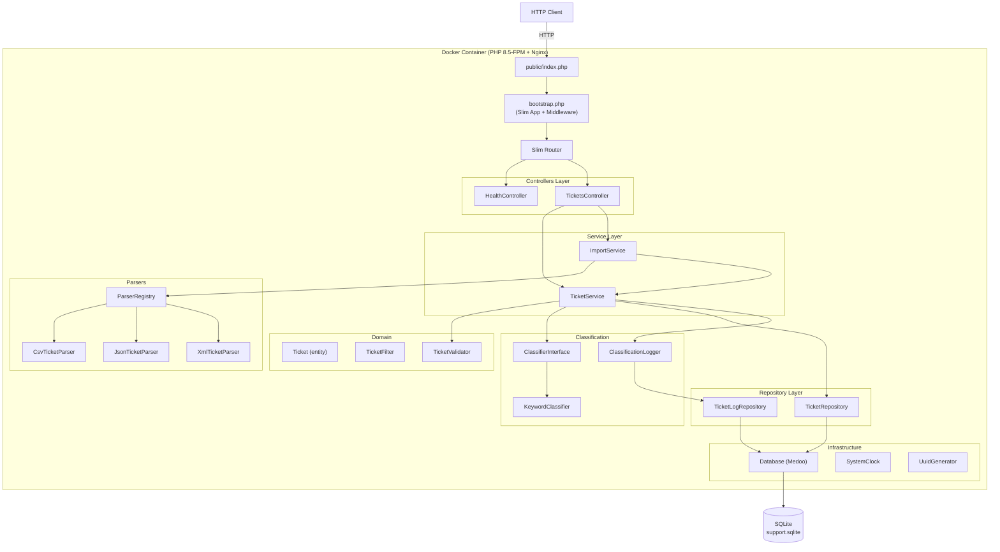
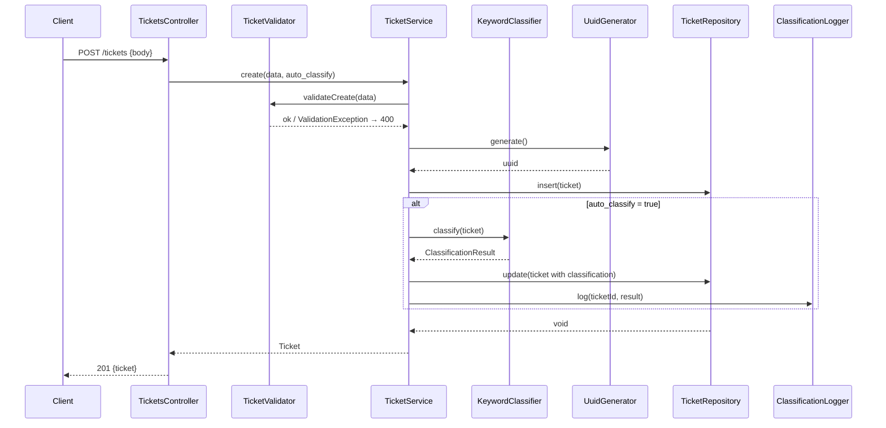
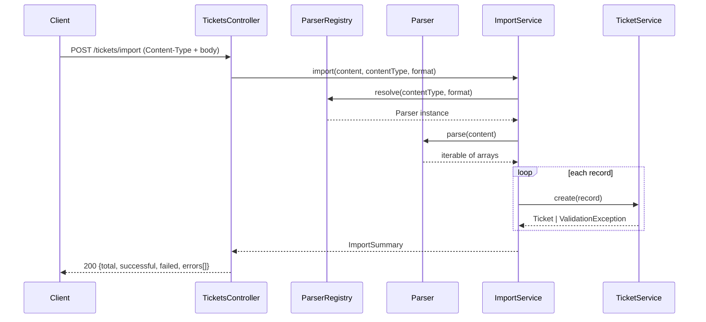
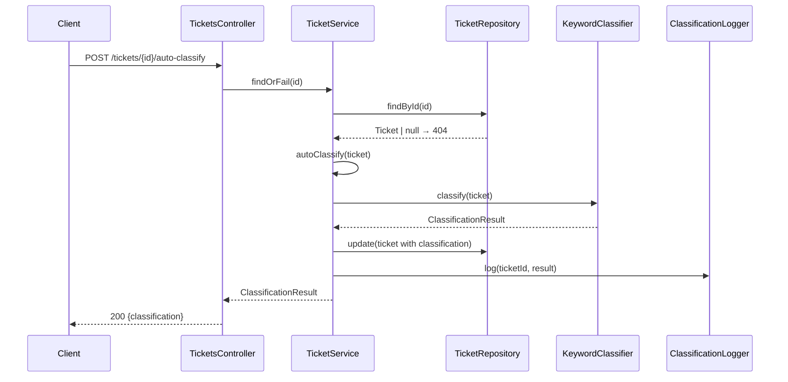

# Architecture — Intelligent Customer Support System

## Overview

A PHP 8.5 REST API built on **Slim 4** for managing customer support tickets. The system supports multi-format bulk import (CSV, JSON, XML), keyword-based automatic classification, and full CRUD with filtering. Data is persisted in **SQLite** via the **Medoo** query builder. Dependency wiring is handled by **PHP-DI 7** with autowiring.

---

## High-Level Architecture



---

## Component Descriptions

### Entry & Bootstrap

| File | Role |
|---|---|
| `public/index.php` | Process entry point. Requires `bootstrap.php`, calls `$app->run()`. |
| `bootstrap.php` | Builds the Slim `App`, registers middleware, wires the DI container, loads routes. |
| `app/routes.php` | Declares all eight routes as a closure injected into the Slim `App`. |

### Controllers

Extend `AbstractController`, which provides `json(Response, mixed, int): Response`.

| Controller | Actions |
|---|---|
| `HealthController` | `__invoke` — returns `{"status":"ok"}` |
| `TicketsController` | `index`, `show`, `create`, `update`, `delete`, `import`, `autoClassify` |

Controllers are thin: they parse HTTP input, delegate to services, and render responses. No business logic lives here.

### Service Layer

**`TicketService`** — orchestrates all ticket operations:
- Validates input via `TicketValidator`
- Generates IDs with `IdGeneratorInterface`
- Persists via `TicketRepository`
- Optionally calls `ClassifierInterface` on create
- Logs classification events via `ClassificationLogger`

**`ImportService`** — bulk import orchestration:
- Resolves the correct parser from `ParserRegistry` by Content-Type or `?format`
- Iterates parsed records, calls `TicketService::create()` for each
- Returns an `ImportSummary` DTO with totals and per-row error details

### Classification

```
ClassifierInterface
    └── KeywordClassifier   — matches subject/description against config keyword lists
    └── NullClassifier      — no-op (used in testing)
```

`KeywordClassifier` is configured from `config/classification.php`. It scores each category and priority by counting keyword hits, normalises to a 0–1 confidence value, and returns a `ClassificationResult` (immutable DTO).

`ClassificationLogger` writes a `ticket_logs` row for every classification event.

### Parsers

```
TicketImportParserInterface
    └── CsvTicketParser    — League\Csv; flattens metadata_* columns, parses tags
    └── JsonTicketParser   — accepts bare array or {"tickets":[...]} wrapper
    └── XmlTicketParser    — XXE-protected; rejects DTD/entity declarations
```

`ParserRegistry` maps MIME types to parser instances and is the only resolver — callers never instantiate parsers directly.

### Domain Objects

| Class | Type | Notes |
|---|---|---|
| `Ticket` | `readonly` entity | Immutable; `with(array)` for field-update copies |
| `TicketMetadata` | `readonly` value object | Nested source/browser/device metadata |
| `TicketFilter` | DTO | Hydrated from query params; encapsulates list query constraints |
| `ClassificationResult` | Immutable DTO | Output of any `ClassifierInterface` implementation |
| `ImportSummary` | DTO | Bulk import result: total, successful, failed, errors |

Enums (`Category`, `Priority`, `Status`, `Source`, `DeviceType`) enforce valid values at the type level.

### Repository Layer

| Class | Responsibility |
|---|---|
| `TicketRepository` | CRUD + filtered list queries against the `tickets` table |
| `TicketLogRepository` | Append-only inserts into `ticket_logs` |

Repositories are the **only** components that touch `Database::query()`. No raw SQL appears above this layer.

### Infrastructure

| Class | Role |
|---|---|
| `Database` | Wraps Medoo; provides `query(): Medoo` and `migrate(string): void` |
| `SystemClock` | Returns `CarbonImmutable::now('UTC')`; injectable via `ClockInterface` |
| `UuidGenerator` | Wraps `Ramsey\Uuid`; injectable via `IdGeneratorInterface` |
| `ContainerFactory` | Singleton builder for the PHP-DI container; `reset()` for tests |

---

## Data Flow Diagrams

### Create Ticket



### Bulk Import



### Auto-Classify Existing Ticket



---

## Database Schema

```
tickets
───────────────────────────────────────────────────────
id                     TEXT PK          UUID v4
customer_id            TEXT NOT NULL
customer_email         TEXT NOT NULL
customer_name          TEXT NOT NULL
subject                TEXT NOT NULL
description            TEXT NOT NULL
category               TEXT NOT NULL    Category enum value
priority               TEXT NOT NULL    Priority enum value
status                 TEXT NOT NULL    default 'new'
assigned_to            TEXT
tags                   TEXT NOT NULL    JSON array e.g. '["billing","urgent"]'
metadata_source        TEXT            Source enum value
metadata_browser       TEXT
metadata_device_type   TEXT            DeviceType enum value
classification_confidence   REAL
classification_reasoning    TEXT
classification_keywords     TEXT        JSON array of matched keywords
created_at             TEXT NOT NULL    ISO 8601
updated_at             TEXT NOT NULL    ISO 8601
resolved_at            TEXT

Indexes: status, category, priority, customer_id, created_at

ticket_logs
───────────────────────────────────────────────────────
id          TEXT PK
ticket_id   TEXT NOT NULL    FK → tickets(id) ON DELETE CASCADE
event       TEXT NOT NULL    e.g. 'auto_classified'
payload     TEXT            JSON
created_at  TEXT NOT NULL
```

**Design notes:**
- UUID text keys — no integer sequences, safe for distributed inserts.
- Metadata denormalised as `metadata_*` prefix columns — avoids a join for the common read path.
- Tags and classification keywords stored as JSON strings — SQLite has no native array type; the application layer marshals them.
- `ticket_logs` is append-only; no update or delete paths exist in the code.

---

## Design Decisions & Trade-offs

### SQLite over a client–server RDBMS
**Decision:** Use SQLite with a file path configurable via `DATABASE_PATH`.  
**Trade-off:** Zero external dependencies for development and CI. Not suitable for multi-process write concurrency at scale; a swap to PostgreSQL would require changing only `config/database.php` and `schema.sql` because Medoo abstracts the dialect.

### Immutable `Ticket` entity with `with()`
**Decision:** `Ticket` is a `readonly` class. Updates return a new instance via `with(array $overrides)`.  
**Trade-off:** Eliminates accidental mutation bugs and makes data flow traceable. Slightly more verbose than mutable setters, but the immutability invariant pays off in tests and concurrent reads.

### Denormalised metadata columns
**Decision:** `metadata_source`, `metadata_browser`, `metadata_device_type` are stored as flat columns rather than a separate table.  
**Trade-off:** Simpler queries, no join overhead. Makes schema migration harder if new metadata fields are added; an EAV table or JSON column would be more flexible but harder to index.

### Keyword classifier as a pure function
**Decision:** `KeywordClassifier::classify()` takes a `Ticket` and returns a `ClassificationResult` with no side effects. Persistence and logging are the caller's responsibility.  
**Trade-off:** Easy to unit test and swap implementations. The confidence scoring is simplistic (keyword count / total keyword count); production systems would replace this with an ML model behind the same `ClassifierInterface`.

### Parser resolution by Content-Type + fallback query param
**Decision:** `ParserRegistry` resolves by `Content-Type` header. A `?format=csv|json|xml` query param overrides it.  
**Trade-off:** Follows HTTP semantics by default while accommodating clients that cannot set headers (e.g., HTML form uploads).

---

## Security Considerations

| Concern | Mitigation |
|---|---|
| **XXE injection** | `XmlTicketParser` calls `libxml_disable_entity_loader(true)` and rejects documents containing `<!DOCTYPE` or `<!ENTITY` declarations before parsing. |
| **CSV formula injection** | `CsvTicketParser` strips leading `=`, `+`, `-`, `@` from cell values that would be interpreted as formulas by spreadsheet software. |
| **SQL injection** | All queries go through Medoo's parameterised query builder. No raw SQL string interpolation. |
| **Input validation** | `TicketValidator` enforces types, enum membership, email format, and string length limits before any record is persisted. |
| **Structured error responses** | `ErrorRenderer` returns field-level details only for `ValidationException` (400). All other exceptions produce generic messages; stack traces are gated behind `APP_DEBUG=true`. |

---

## Performance Considerations

| Concern | Approach |
|---|---|
| **List query performance** | Five covering indexes on `tickets` (status, category, priority, customer_id, created_at) match the supported filter and sort columns. |
| **Pagination** | `TicketFilter` enforces `limit ∈ [1, 200]` (default 50) and supports `offset` to bound result set size. |
| **Bulk import throughput** | `TicketRepository::insertBatch()` wraps multiple inserts. Individual row errors are caught and collected without aborting the whole import. |
| **Clock & ID abstraction** | `ClockInterface` and `IdGeneratorInterface` are injected, enabling fake implementations in tests — no `sleep()` or real UUID entropy consumed in the test suite. |
| **In-memory DB for tests** | `DATABASE_PATH=:memory:` is set in `AppTestCase`; schema is re-applied per test class. Keeps the test suite fast with no disk I/O. |
