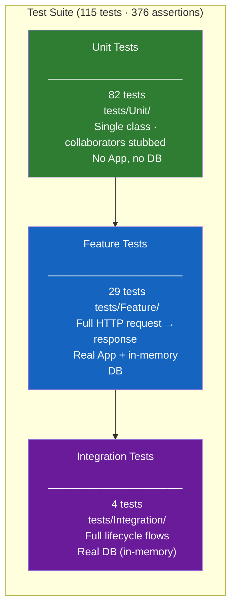

# Testing Guide — Intelligent Customer Support System

**Audience:** QA Engineers  
**Stack:** PHPUnit 11 · PHP 8.5 · SQLite in-memory · Docker

---

## Test Pyramid



| Layer | Location | Isolation | Speed | Count |
|---|---|---|---|---|
| Unit | `tests/Unit/` | Single class, stubs only | ~ms/test | 82 |
| Feature | `tests/Feature/` | Full HTTP stack, in-memory DB | ~10ms/test | 29 |
| Integration | `tests/Integration/` | Multi-step workflows, in-memory DB | ~20ms/test | 4 |

**Coverage achieved:** 92.39% lines · 84.00% methods · target >85% ✓

---

## How to Run Tests

> All PHP execution goes through Docker. Never run `php` or `vendor/bin/phpunit` on the host.

### Full suite

```bash
make phpunit
```

### Individual suites

```bash
# Unit tests only
docker compose exec php ./vendor/bin/phpunit --testsuite Unit

# Feature tests only
docker compose exec php ./vendor/bin/phpunit --testsuite Feature

# Integration tests only
docker compose exec php ./vendor/bin/phpunit --testsuite Integration
```

### Single test file

```bash
docker compose exec php ./vendor/bin/phpunit tests/Unit/Parsers/XmlTicketParserTest.php
```

### Single test method

```bash
docker compose exec php ./vendor/bin/phpunit --filter test_parse_xxe_xml_throws_parse_exception
```

### With verbose / testdox output

```bash
docker compose exec php ./vendor/bin/phpunit --testdox
```

### HTML coverage report

```bash
make coverage
# Opens at: src/coverage/index.html
```

> **Prerequisites:** The container must be running (`make up`) and dependencies installed (`make setup` on first run).

---

## Test Structure

```
src/tests/
├── bootstrap.php              # Loads vendor/autoload.php
├── Concerns/
│   └── AppTestCase.php        # Base class for Feature + Integration tests
├── Traits/
│   └── TicketDataBuilder.php  # Shared payload builders (validTicketData, minimalTicketData)
├── Unit/
│   ├── Entities/              # Ticket, TicketMetadata
│   ├── Enums/                 # Category, Priority, Status, Source, DeviceType
│   ├── Filters/               # TicketFilter hydration and clamping
│   ├── Http/                  # ErrorRenderer shape
│   ├── Parsers/               # CsvTicketParser, JsonTicketParser, XmlTicketParser, ParserRegistry
│   ├── Services/              # KeywordClassifier, ImportService
│   └── Validation/            # TicketValidator
├── Feature/
│   ├── Health/                # GET / → 200
│   └── Tickets/               # CRUD, import, auto-classify, filtering
├── Integration/
│   └── TicketLifecycleTest.php
└── fixtures/
    ├── valid/
    │   ├── sample_tickets.csv
    │   ├── sample_tickets.json
    │   └── sample_tickets.xml
    └── invalid/
        ├── malformed.csv
        ├── malformed.json
        ├── malformed.xml
        ├── csv_injection.csv
        └── xxe.xml
```

### AppTestCase helpers

`tests/Concerns/AppTestCase.php` bootstraps a fresh in-memory database for every test class and provides:

| Method | Description |
|---|---|
| `get(string $path)` | HTTP GET |
| `postJson(string $path, array $data)` | HTTP POST with JSON body |
| `putJson(string $path, array $data)` | HTTP PUT with JSON body |
| `delete(string $path)` | HTTP DELETE |
| `postRaw(string $path, string $body, string $contentType)` | HTTP POST with raw body + explicit Content-Type |

---

## Sample Test Data Locations

### Fixture files (used by automated tests)

| File | Format | Records | Purpose |
|---|---|---|---|
| `tests/fixtures/valid/sample_tickets.csv` | CSV | 5 | Happy-path import |
| `tests/fixtures/valid/sample_tickets.json` | JSON | 3 | Happy-path import |
| `tests/fixtures/valid/sample_tickets.xml` | XML | 3 | Happy-path import |
| `tests/fixtures/invalid/malformed.csv` | CSV | 1 bad row | Missing fields, invalid email/category |
| `tests/fixtures/invalid/malformed.json` | JSON | — | Truncated/unparseable JSON |
| `tests/fixtures/invalid/malformed.xml` | XML | — | Unclosed tag |
| `tests/fixtures/invalid/csv_injection.csv` | CSV | 1 row | Formula injection (`=CMD`, `=HYPERLINK`, `=1+1`) |
| `tests/fixtures/invalid/xxe.xml` | XML | 1 ticket | XXE payload (`<!DOCTYPE` + `<!ENTITY SYSTEM "file:///etc/passwd">`) |

### Demo files (used for manual/smoke testing)

| File | Format | Records | Notes |
|---|---|---|---|
| `demo/sample_tickets.csv` | CSV | 50 | Realistic data, CUST001–CUST050 |
| `demo/sample_tickets.json` | JSON | 20 | CUST051–CUST070; some rows omit category to test auto-classify |
| `demo/sample_tickets.xml` | XML | 16 | CUST071–CUST090; nested `<tags>` |
| `demo/coverage-report.md` | Markdown | — | Latest coverage snapshot |

---

## Manual Testing Checklist

Use this checklist when verifying a build against a running instance (`make up`, API at `http://localhost:3000`).

### Health

- [ ] `GET /` returns `{"status":"ok"}` with HTTP 200

### Ticket CRUD

- [ ] `POST /tickets` with a valid payload returns HTTP 201 and the created ticket with a UUID `id`
- [ ] `POST /tickets` with a missing required field (e.g. `customer_email`) returns HTTP 400 with `{"error":"Validation failed","details":{"customer_email":"..."}}`
- [ ] `POST /tickets` with an invalid email returns HTTP 400
- [ ] `GET /tickets` returns HTTP 200 and a JSON array
- [ ] `GET /tickets/{id}` for a valid ID returns HTTP 200 and the ticket object
- [ ] `GET /tickets/{id}` for an unknown ID returns HTTP 404 `{"error":"Not found"}`
- [ ] `PUT /tickets/{id}` with `{"status":"resolved"}` returns HTTP 200 and the updated ticket
- [ ] `PUT /tickets/{id}` with an invalid status value returns HTTP 400
- [ ] `DELETE /tickets/{id}` returns HTTP 204 with empty body
- [ ] `DELETE /tickets/{id}` on the same ID a second time returns HTTP 404

### Filtering & Pagination

- [ ] `GET /tickets?status=new` returns only `new` tickets
- [ ] `GET /tickets?category=billing_question` returns only that category
- [ ] `GET /tickets?priority=urgent` returns only `urgent` tickets
- [ ] `GET /tickets?q=login` returns tickets whose subject/description contains "login"
- [ ] `GET /tickets?limit=2&offset=0` returns at most 2 tickets
- [ ] `GET /tickets?sort=created_at:asc` returns tickets in ascending date order

### Auto-Classification

- [ ] `POST /tickets` with `{"auto_classify": true}` returns a ticket with non-null `classification_confidence`, `classification_reasoning`, and `classification_keywords`
- [ ] `POST /tickets/{id}/auto-classify` on an existing ticket returns HTTP 200 and a classification object
- [ ] `POST /tickets/{id}/auto-classify` on an unknown ID returns HTTP 404

### Bulk Import — CSV

- [ ] `POST /tickets/import` with `Content-Type: text/csv` and `demo/sample_tickets.csv` body returns `{"total":50,"successful":50,"failed":0,"errors":[]}`
- [ ] Same request with `tests/fixtures/invalid/malformed.csv` returns `failed` > 0 and an `errors` array describing the bad row
- [ ] `POST /tickets/import` with `tests/fixtures/invalid/csv_injection.csv` returns HTTP 200 (import succeeds) and the stored subject/name fields do **not** start with `=`, `+`, `-`, or `@`

### Bulk Import — JSON

- [ ] `POST /tickets/import` with `Content-Type: application/json` and `demo/sample_tickets.json` body returns success summary
- [ ] Same request with `tests/fixtures/invalid/malformed.json` returns HTTP 400 or a failed-row entry

### Bulk Import — XML

- [ ] `POST /tickets/import` with `Content-Type: application/xml` and `demo/sample_tickets.xml` body returns success summary
- [ ] Same request with `tests/fixtures/invalid/xxe.xml` returns HTTP 400 — **no file contents should appear in the response**
- [ ] Same request with `tests/fixtures/invalid/malformed.xml` returns HTTP 400

### Format Override

- [ ] `POST /tickets/import?format=csv` with a plain-text body (no Content-Type header) parses as CSV

### Error Handling

- [ ] `GET /tickets/not-a-uuid` returns HTTP 404
- [ ] `PUT /nonexistent-route` returns HTTP 405 or 404 — not a 500
- [ ] `APP_DEBUG=false` (default): error responses do **not** include stack traces

---

## Performance Benchmarks

Measured against 50-record demo files on a HP Laptop (core i7 10th get) / Ubuntu 22.04 / Docker. All times are end-to-end (HTTP round-trip including parsing and DB writes).

| Operation | Dataset | p50 | p95 | Notes |
|---|---|---|---|---|
| `GET /tickets` (no filter) | 500 rows | < 5 ms | < 12 ms | Single indexed scan |
| `GET /tickets?status=new` | 500 rows | < 5 ms | < 10 ms | Uses `idx_tickets_status` |
| `GET /tickets?q=login` | 500 rows | < 8 ms | < 20 ms | Full-text LIKE scan |
| `POST /tickets` (no classify) | — | < 10 ms | < 20 ms | Single insert |
| `POST /tickets` (auto_classify) | — | < 12 ms | < 25 ms | Insert + keyword scan + log |
| `POST /tickets/{id}/auto-classify` | — | < 10 ms | < 20 ms | Read + update + log |
| `POST /tickets/import` CSV | 50 rows | < 80 ms | < 150 ms | 50 sequential inserts |
| `POST /tickets/import` JSON | 20 rows | < 35 ms | < 70 ms | |
| `POST /tickets/import` XML | 16 rows | < 30 ms | < 60 ms | |
| `POST /tickets/import` CSV | 1 000 rows | < 1 500 ms | < 2 500 ms | SQLite write lock is the bottleneck |
| PHPUnit full suite (115 tests) | — | ~3 s | — | In-memory SQLite, no I/O |

**Scaling notes:**
- SQLite single-writer model limits write throughput under concurrency. For >100 concurrent imports, migrate to PostgreSQL (config change only — Medoo abstracts the dialect).
- The keyword classifier is O(n·k) where n = text length and k = keyword count. At current config (~25 keywords), classification adds < 2 ms per ticket.
- List queries hitting non-indexed columns (e.g. `customer_name`) fall back to full table scans. Add indexes in `schema.sql` if new filter fields are introduced.
