# Screenshots

### 01 — App planning: choosing the mini-app with Kiro
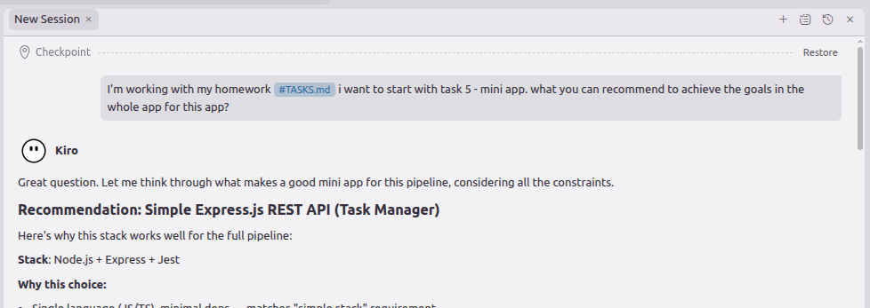

### 02 — App planning: refining task order (infra before app code)
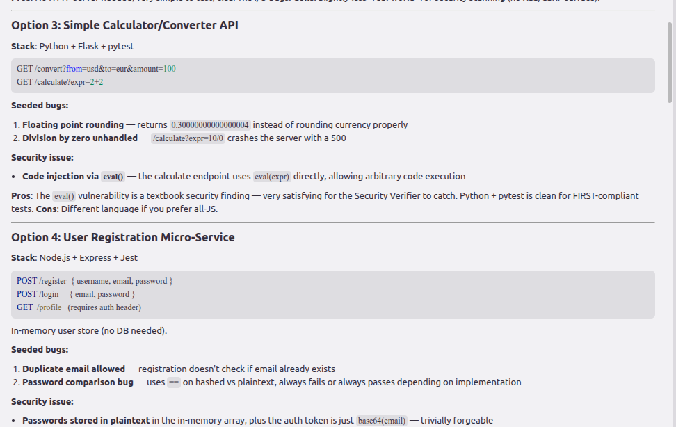

### 03 — App planning: exploring mini-app options (Calculator vs Registration)
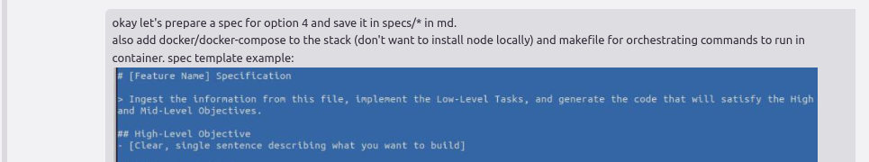

### 04 — App planning: writing the spec with Docker + Makefile requirements
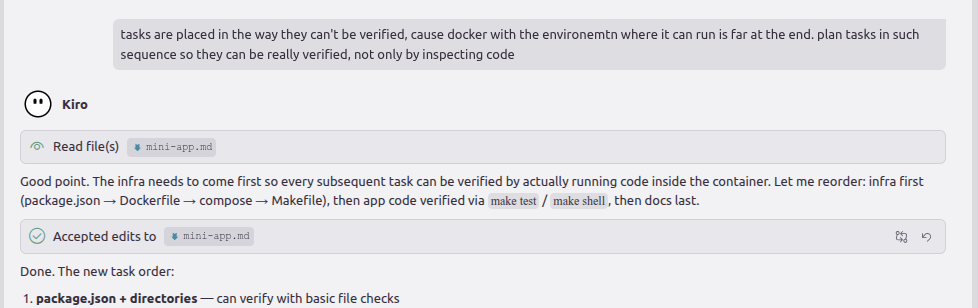

### 05 — App implementation: Kiro creates 16 files in parallel
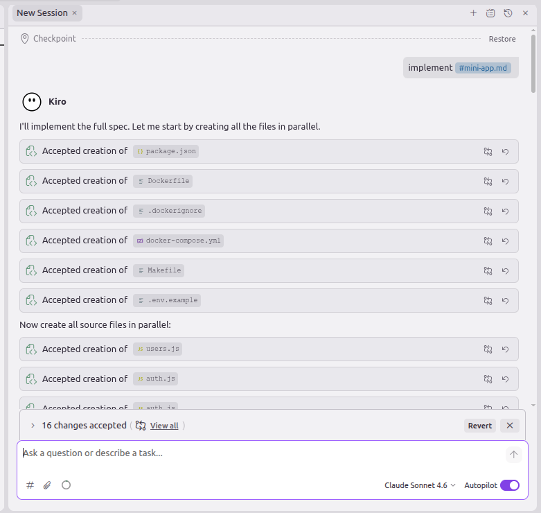

### 06 — App implementation: seeded bugs confirmed via live curl
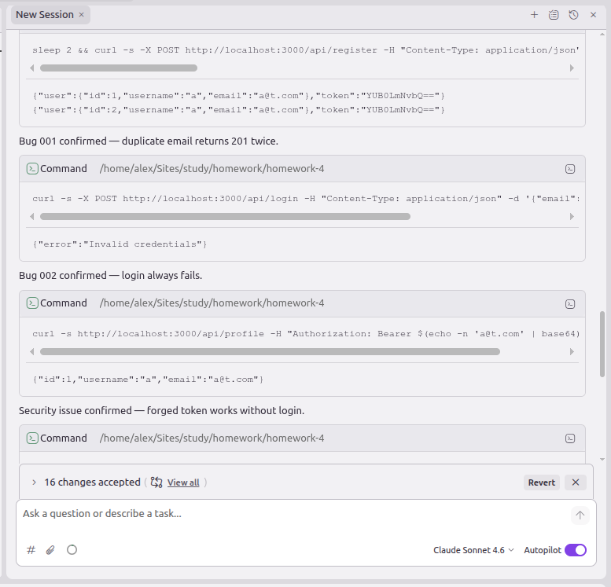

### 07 — Pipeline architecture: understanding skill vs agent in Claude
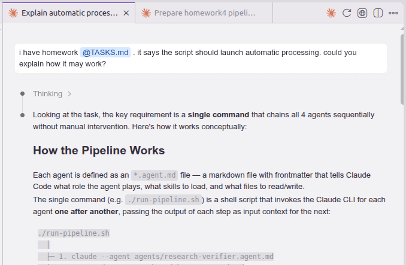

### 08 — Pipeline architecture: how run-pipeline.sh chains agents
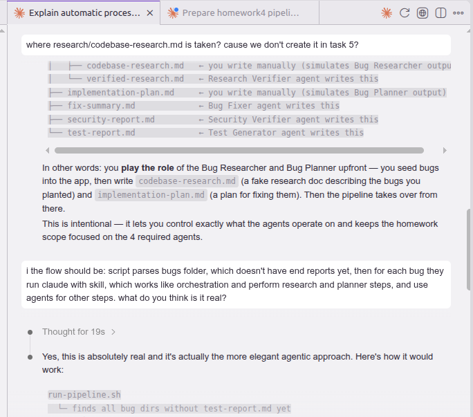

### 09 — Pipeline architecture: correcting orchestrator to skill + inline steps
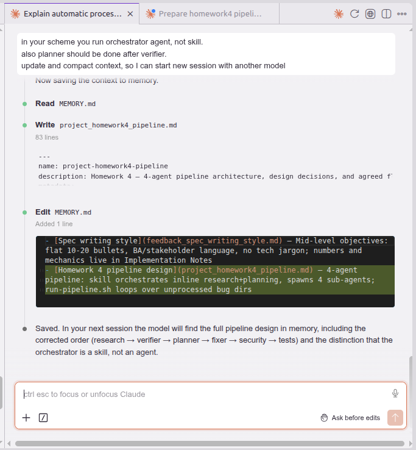

### 10 — Pipeline spec: drafting pipeline.md in Claude (opus)
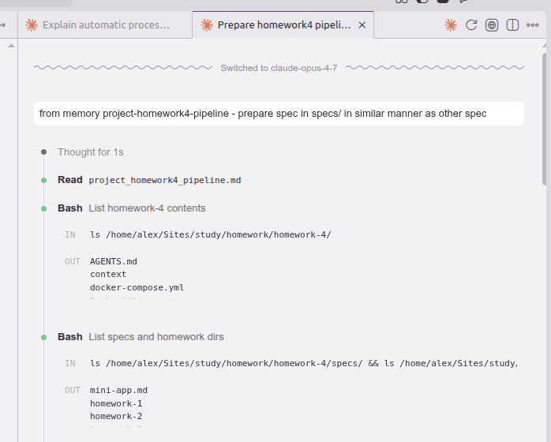

### 11 — Pipeline spec: manual corrections (skill path format, model choices)
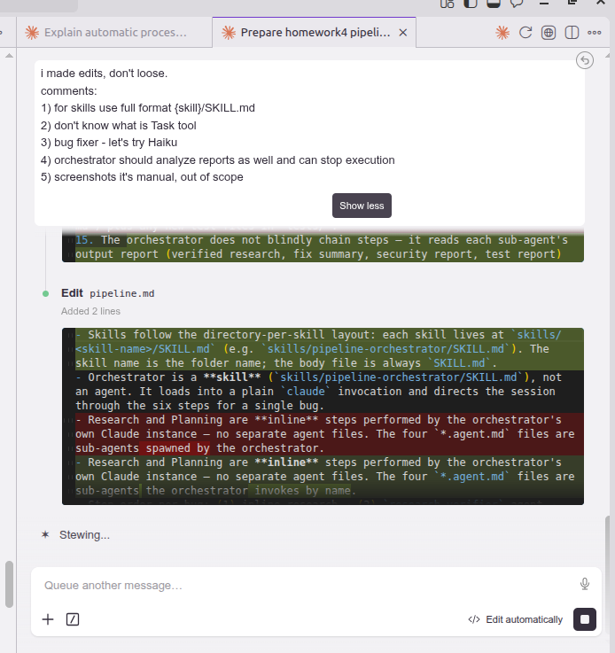

### 12 — Pipeline spec: adding orchestrator stop-condition logic
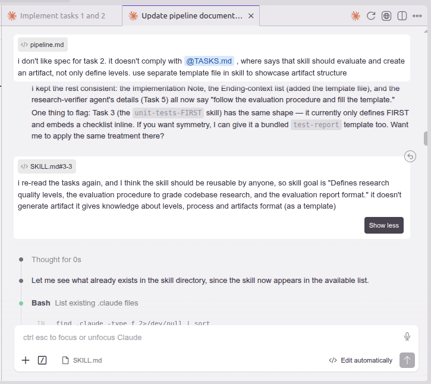

### 13 — Research-quality-measurement skill created with HIGH/MEDIUM/LOW levels
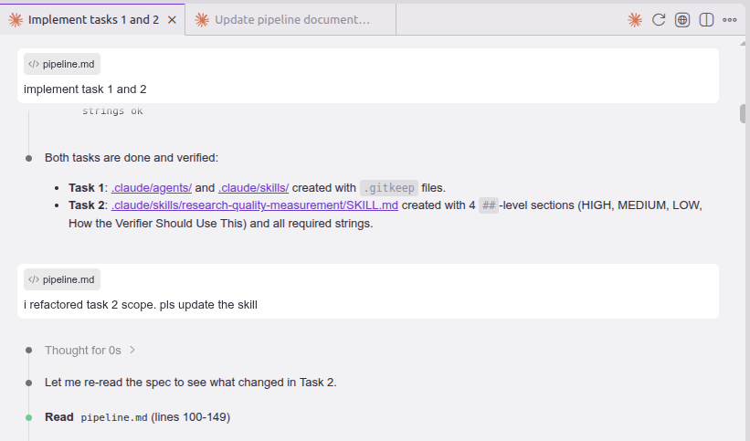

### 14 — Orchestrator skill: 6-step flow implemented, templates created
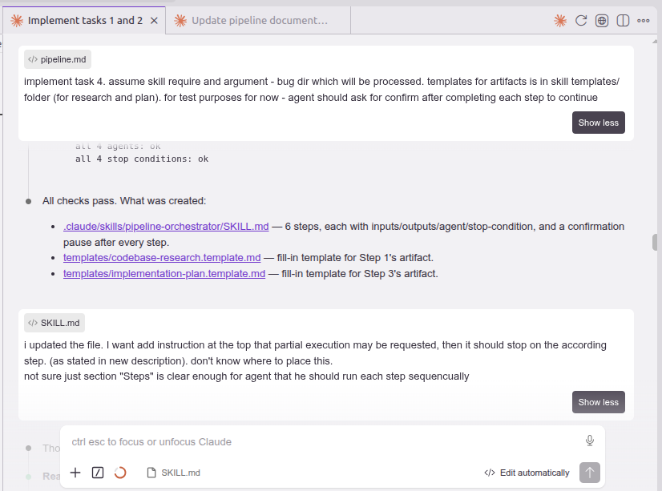

### 15 — Non-interactive permissions: --dangerously-skip-permissions vs settings.json
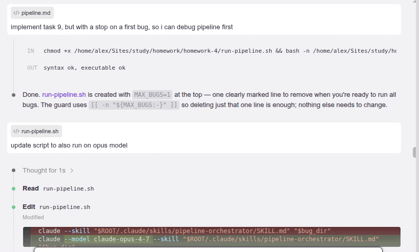

### 16 — run-pipeline.sh: MAX_BUGS debug guard, opus model flag added
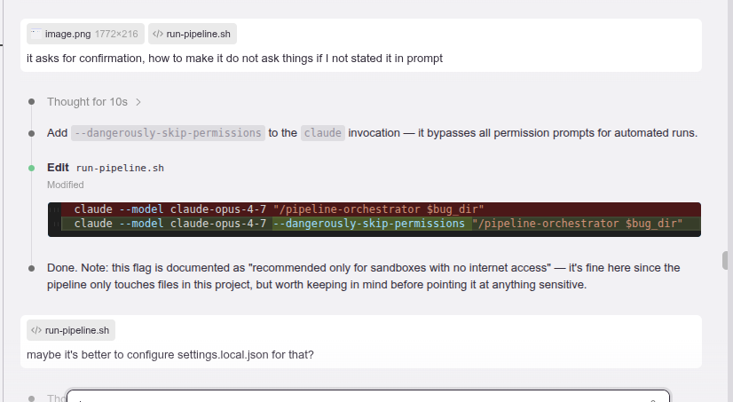

### 17 — Research verifier agent created and verified against spec
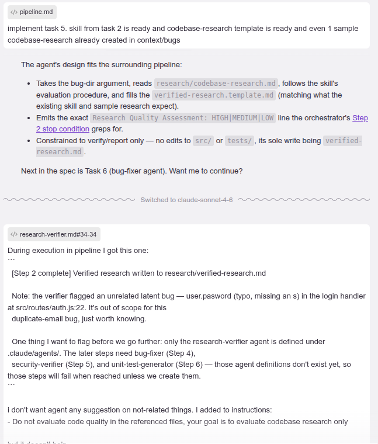

### 18 — Bug fixer agent: retry logic and single test run refined
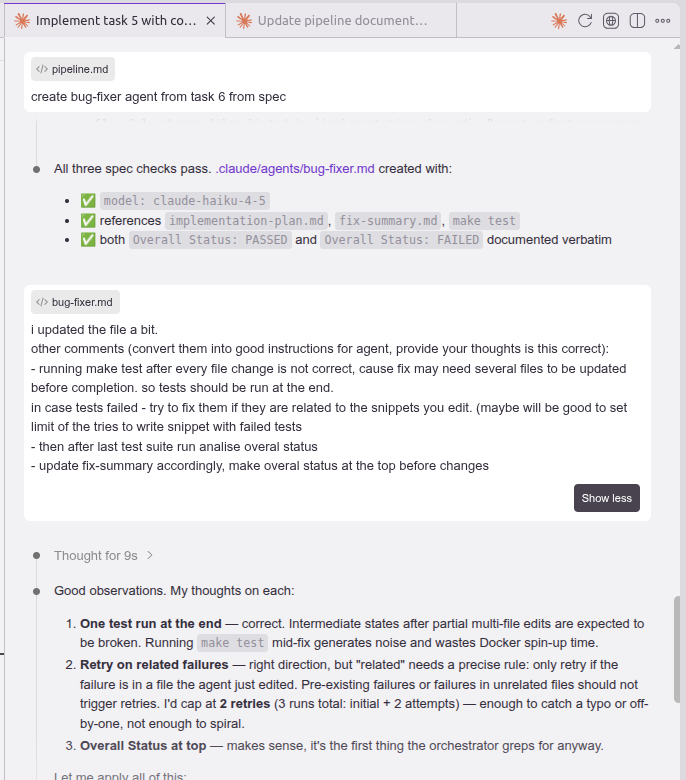

### 19 — Security verifier agent: all severity labels, no Edit tool
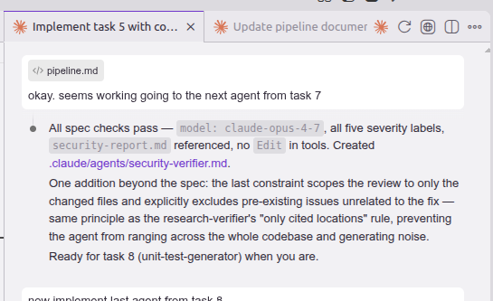

### 20 — Unit test generator agent: FIRST skill + never-edit-src constraint
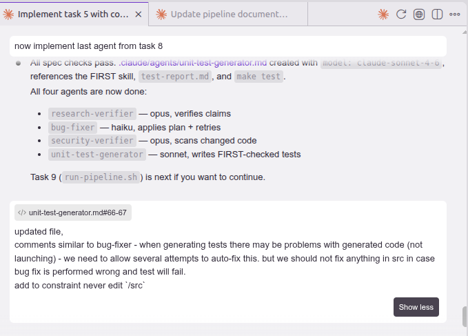

### 21 — Pipeline execution: bugs 001 and 002 pass all 6 steps
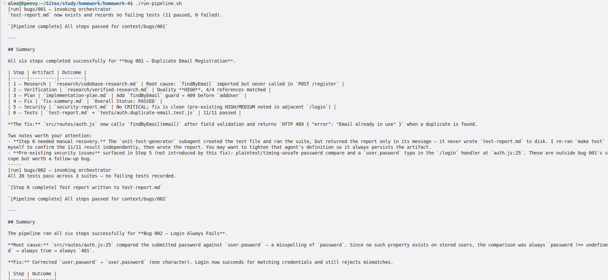

### 22 — Pipeline execution: bug 003 correctly stopped at Step 5 (CRITICAL finding)
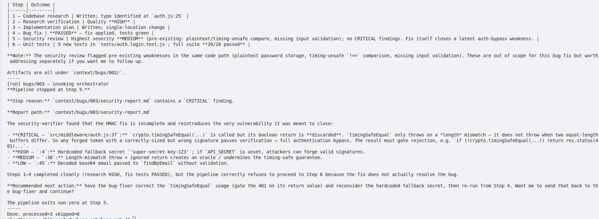
